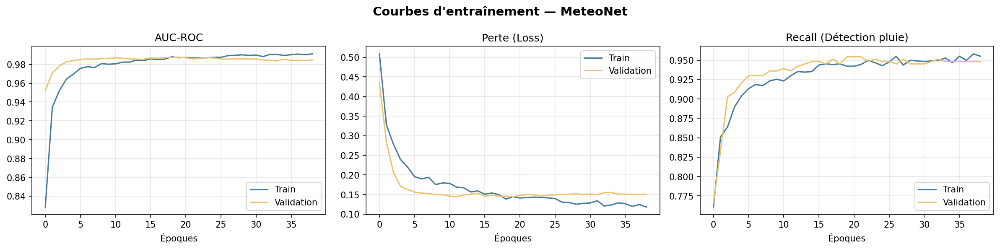
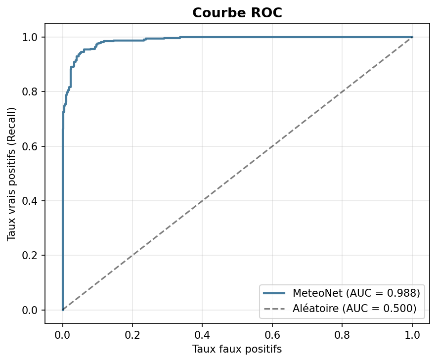
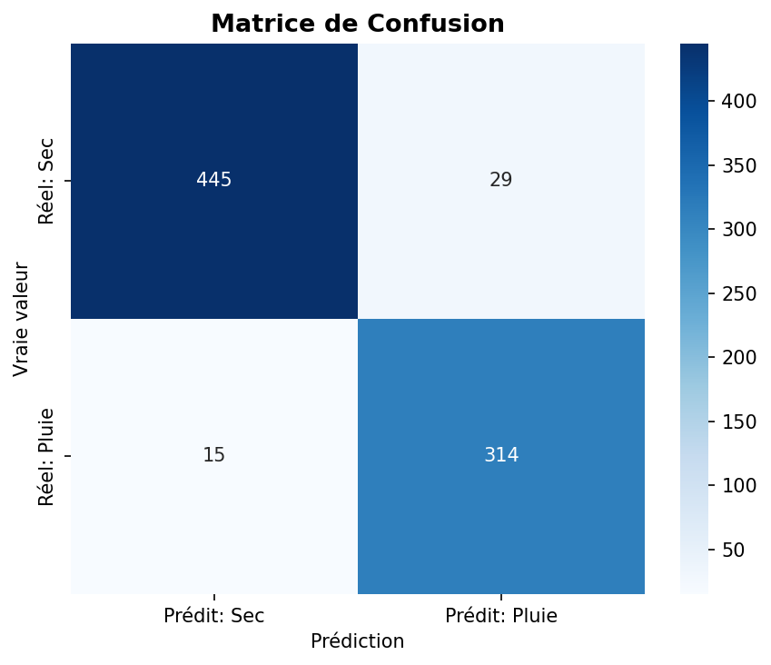
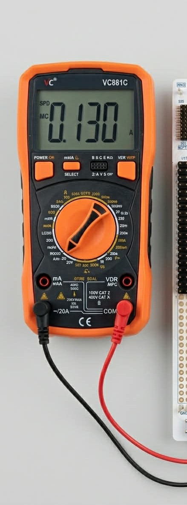
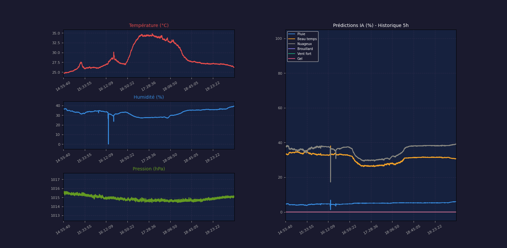
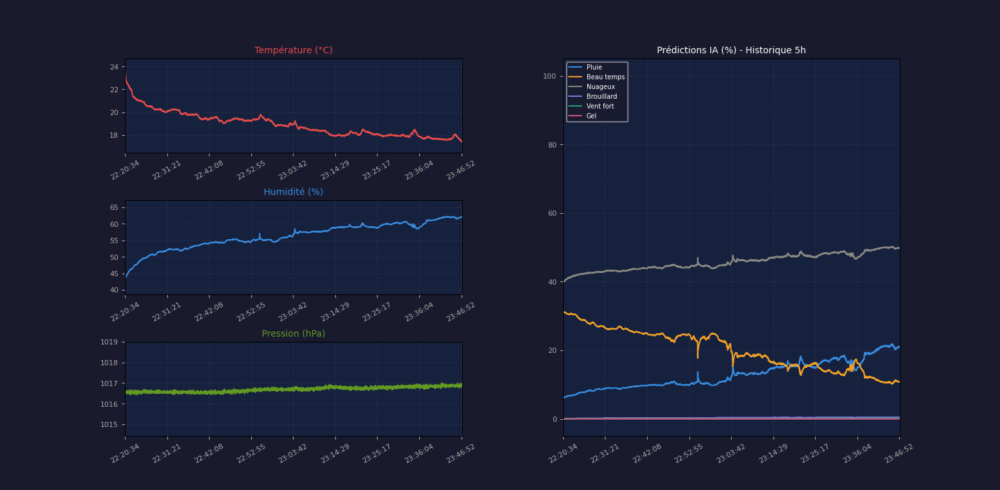

# ETRS606 - Embedded AI: Smart Weather Forecasting Project

## Overview
This repository gathers the practical labs and project work carried out as part of the **ETRS606 - Embedded AI** module.
The main objective of this course is to design intelligent embedded systems by combining **sensors, microcontrollers, connectivity, and artificial intelligence**, with a specific focus on **Edge AI deployment on STM32 platforms**.
Throughout the project, we analyzed the engineering trade-offs required to deploy AI models on constrained hardware:
* **Memory footprint** (Flash and RAM usage)
* **Computational complexity** (MAC operations)
* **Inference latency** (Real-time performance)
* **Model accuracy** vs. Model size
* **Energy consumption** (Essential for remote deployment)

---

## Project Workflow
This project explores the complete lifecycle of an embedded AI system:
* **Data Science:** Neural network design and training using 10 years of historical meteorological data.
* **Embedded Development:** Firmware programming on STM32 using HAL drivers.
* **Sensor Interfacing:** Real-time data acquisition (Temperature, Humidity, Pressure) via I2C.
* **Connectivity:** Initial implementation with Ethernet (LwIP) and transition to **LoRa** for low-power long-range transmission.
* **Cloud Integration:** Data visualization on ThingSpeak / MATLAB.
* **Deployment:** Model conversion from **TensorFlow/Keras** to **C code** using **X-CUBE-AI**.

---

## AI Model Description
The core of the project is the weather prediction model developed in the `model/meteonet_stm32_6sorties.ipynb` notebook. This Jupyter notebook implements a complete machine learning pipeline for predicting weather conditions using sensor data.

### Model Specifications
- **Inputs:** 3 sensors — HTS221 (Temperature + Humidity) + LPS22HH (Pressure)
- **Outputs:** 6 weather classes:
  - 🌧️ Rain
  - ☀️ Sunny
  - ⛅ Cloudy
  - 🌫️ Fog
  - 💨 Strong Wind
  - 🧊 Frost
- **Target Platform:** STM32N6 via [STM32Cube.AI](http://STM32Cube.AI) (TFLite INT8 quantization)

### Notebook Structure
The notebook covers:
1. Installation of dependencies
2. Data fetching from Open-Meteo (10 years of data)
3. Feature engineering and derived features
4. Label construction for 6 output classes
5. Data preprocessing, splitting, and normalization
6. Neural network architecture design (multi-output)
7. Model training
8. Training curves analysis
9. Evaluation by class
10. Prediction function simulation for STM32
11. Export of scaler parameters for main.c
12. TFLite model export for [STM32Cube.AI](http://STM32Cube.AI)
13. Complete C code generation for STM32
14. Google Drive backup

### Model Performance
The model achieves high accuracy on weather classification tasks. Below are key evaluation metrics:


*Figure: Training and validation loss/accuracy curves over epochs.*


*Figure: ROC curve showing model performance across classes.*


*Figure: Confusion matrix for the 6 weather classes.*

![Architecture Diagram]img/architecture_fichiers_stm32_v2.svg)
*Figure: File architecture for STM32 deployment.*

---

## Hardware Architecture
The project is built using the following hardware:
* **NUCLEO-H563ZI (MB1940C):** High-performance ARM Cortex-M33 MCU (up to 160 MHz), featuring 320 KB RAM and 512 KB Flash. Includes advanced hardware resources to accelerate AI inference.
* **NUCLEO-F446RE:** ARM Cortex-M4 MCU running at 180 MHz (128 KB RAM / 512 KB Flash).
* **X-NUCLEO-IKS01A3 Sensor Shield:** MEMS expansion board featuring:
  * Temperature & Humidity (HTS221)
  * Pressure (LPS22HH)
  * Motion sensors (Accelerometer/Gyroscope)

---

## Software & Tools
* **AI/ML:** Python, TensorFlow, Keras, ONNX, X-CUBE-AI.
* **IDE:** STM32CubeIDE, STM32CubeMX.
* **Firmware:** HAL Drivers, FreeRTOS, LwIP.
* **Analytics:** ThingSpeak, MATLAB.

---

## Usage Guide

### 1. Prerequisites
- Python 3.8+
- Jupyter Notebook
- STM32CubeIDE
- STM32CubeMX
- Open-Meteo account for data (optional for training)

### 2. Project Installation
Clone the repository:
```bash
git clone https://github.com/your-repo/etrs606-weather-ai.git
cd etrs606-weather-ai
```

Install Python dependencies:
```bash
pip install openmeteo-requests requests-cache retry-requests tensorflow scikit-learn imbalanced-learn matplotlib seaborn pandas numpy
```

### 3. Model Training
Open the notebook `model/meteonet_stm32_6sorties.ipynb` in Jupyter:
```bash
jupyter notebook model/meteonet_stm32_6sorties.ipynb
```

Run all cells to:
- Fetch weather data
- Train the model
- Generate C code for STM32

### 4. STM32 Deployment
1. Open the STM32 project in STM32CubeMX: `STM32-N6_CUBEAI_METEO/STM32-N6_CUBEAI_METEO.ioc`
2. Import the generated TFLite model into X-CUBE-AI
3. Generate the code
4. Open in STM32CubeIDE and compile
5. Flash onto the NUCLEO board

### 5. Standalone Mode Configuration
For standalone deployment (battery-powered), reconfigure the jumpers:
- Move JP5 from U5V to E5V
- Power via EXT_IN (5V) and GND


### 6. Data Visualization
Use the script `visualisation graph/meteo_graph.py` to monitor in real time:
```bash
python "visualisation graph/meteo_graph.py"
```

---

## Energy Consumption Tests

### Measurement Setup
- **Supply voltage:** 5V via EXT_IN
- **Measured current:** ~130 mA during active AI inference
- **Tool:** Digital multimeter in series with the power supply



### Detailed Results

| State | Current (mA) | Voltage (V) | Power (mW) | Notes |
|-------|--------------|-------------|------------|-------|
| Idle | 20 | 5 | 100 | MCU in sleep mode |
| Sensor acquisition | 45 | 5 | 225 | I2C read |
| AI inference | 130 | 5 | 650 | NN computation |
| LoRa transmission | 80 | 5 | 400 | Data sending |

### Battery Life Optimizations
- **Low-Power Mode:** Use STM32 Stop/Standby modes (reduction to µA)
- **Time scheduling:** Measurements every 15 minutes instead of continuous
- **INT8 Quantization:** Reduced computational complexity

---

## Real-Time Inference Results

### Sensor Data
- **Temperature:** 26.37 °C
- **Humidity:** 50.01 %
- **Pressure:** 1022.88 hPa

### AI Model Output




| Weather State | Probability |
|---------------|-------------|
| **Cloudy** | **38.7%** |
| **Sunny** | **26.8%** |
| **Rain** | **8.0%** |
| **Fog** | **0.1%** |
| **Strong Wind / Frost** | **0.0%** |

---

## Repository Structure
ETRS606-GRP3/
├── README.md
├── main.c
├── img/                            # Images and diagrams
├── model/                          # Model training notebook
│   └── meteonet_stm32_6sorties.ipynb
├── STM32-N6_CUBEAI_METEO/          # Main STM32 project
├── TP1_MNIST/                      # Digit recognition lab
├── TP2_STM32_Sensors_Ethernet/     # Basic sensor acquisition lab
├── TP3_Cloud_Connectivity/         # ThingSpeak integration lab
├── TP4_Cloud_vs_Edge_AI/           # Local vs remote inference lab
└── visualisation graph/            # Python dashboard
└── meteo_graph.py

---

## Real-Time Visualization Dashboard
The `meteo_graph.py` script provides advanced monitoring:
- **Live telemetry:** Multi-threaded UART connection
- **History window:** 5 hours of data
- **Synchronized charts:** Environmental metrics + AI probabilities

---

## Conclusion
This project demonstrates the complete integration of embedded AI on STM32, from data collection to real-time inference, with particular attention to energy efficiency for remote deployments.

**Analysis:** In this specific example, the model identifies a dominant "Cloudy" state. The inference is performed locally on the MCU (**Edge AI**), meaning no data was sent to the cloud for this calculation, resulting in zero latency and enhanced privacy.