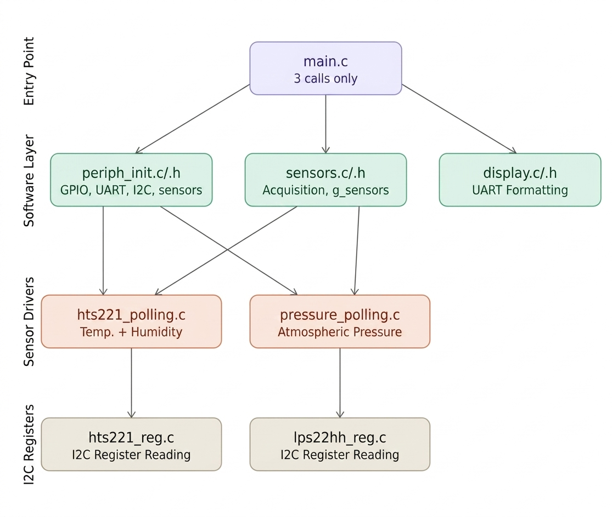

# ETRS606 - Embedded AI: Smart Weather Forecasting Project

## Overview

This repository gathers the practical labs and project work carried out as part of the **ETRS606 - Embedded AI** module.

The main objective of this course is to design intelligent embedded systems by combining **sensors, microcontrollers, connectivity, and artificial intelligence**, with a specific focus on **Edge AI deployment on STM32 platforms**.

Throughout the project, we analyzed the engineering trade-offs required to deploy AI models on constrained hardware:
* **Memory footprint** (Flash and RAM usage)
* **Computational complexity** (MAC operations)
* **Inference latency** (Real-time performance)
* **Model accuracy** vs. Model size
* **Energy consumption** (Essential for remote deployment)

---

## Project Workflow

This project explores the complete lifecycle of an embedded AI system:
* **Data Science:** Neural network design and training using 10 years of historical meteorological data.
* **Embedded Development:** Firmware programming on STM32 using HAL drivers.
* **Sensor Interfacing:** Real-time data acquisition (Temperature, Humidity, Pressure) via I2C.
* **Connectivity:** Initial implementation with Ethernet (LwIP) and transition to **LoRa** for low-power long-range transmission.
* **Cloud Integration:** Data visualization on ThingSpeak / MATLAB.
* **Deployment:** Model conversion from **TensorFlow/Keras** to **C code** using **X-CUBE-AI**.

---

## AI Model Description

The core of the project is the weather prediction model developed in the `model/meteonet_stm32_6sorties.ipynb` notebook. This Jupyter notebook implements a complete machine learning pipeline for predicting weather conditions using sensor data.

### Model Specifications
- **Inputs:** 3 sensors - HTS221 (Temperature + Humidity) + LPS22HH (Pressure)
- **Outputs:** 6 weather classes:
  - 🌧️ Pluie (Rain)
  - ☀️ Beau temps (Sunny)
  - ⛅ Nuageux (Cloudy)
  - 🌫️ Brouillard (Fog)
  - 💨 Vent fort (Strong Wind)
  - 🧊 Gel (Frost)
- **Target Platform:** STM32N6 via STM32Cube.AI (TFLite INT8 quantization)

### Notebook Structure
The notebook covers:
1. Installation of dependencies
2. Data fetching from Open-Meteo (10 years of data)
3. Feature engineering and derived features
4. Label construction for 6 output classes
5. Data preprocessing, splitting, and normalization
6. Neural network architecture design (multi-output)
7. Model training
8. Training curves analysis
9. Evaluation by class
10. Prediction function simulation for STM32
11. Export of scaler parameters for main.c
12. TFLite model export for STM32Cube.AI
13. Complete C code generation for STM32
14. Google Drive backup

### Model Performance
The model achieves high accuracy on weather classification tasks. Below are key evaluation metrics:


*Figure: Training and validation loss/accuracy curves over epochs.*


*Figure: ROC curve showing model performance across classes.*


*Figure: Confusion matrix for the 6 weather classes.*


*Figure: File architecture for STM32 deployment.*

---

## Hardware Architecture

The project is built using the following hardware:

* **NUCLEO-H563ZI (MB1940C):** High-performance ARM Cortex-M33 MCU (up to 160 MHz), featuring 320 KB RAM and 512 KB Flash. It includes advanced hardware resources to accelerate AI inference.
* **NUCLEO-F446RE:** ARM Cortex-M4 MCU running at 180 MHz (128 KB RAM / 512 KB Flash).
* **X-NUCLEO-IKS01A3 Sensor Shield:** MEMS expansion board featuring:
    * Temperature & Humidity (HTS221)
    * Pressure (LPS22HH)
    * Motion sensors (Accelerometer/Gyroscope)

---

## Software & Tools

* **AI/ML:** Python, TensorFlow, Keras, ONNX, X-CUBE-AI.
* **IDE:** STM32CubeIDE, STM32CubeMX.
* **Firmware:** HAL Drivers, FreeRTOS, LwIP.
* **Analytics:** ThingSpeak, MATLAB.

---

## Guide d'Utilisation (Usage Guide)

### 1. Prérequis (Prerequisites)
- Python 3.8+
- Jupyter Notebook
- STM32CubeIDE
- STM32CubeMX
- Compte Open-Meteo pour les données (optionnel pour entraînement)

### 2. Installation du Projet
Clonez le repository :
```bash
git clone https://github.com/your-repo/etrs606-weather-ai.git
cd etrs606-weather-ai
```

Installez les dépendances Python :
```bash
pip install openmeteo-requests requests-cache retry-requests tensorflow scikit-learn imbalanced-learn matplotlib seaborn pandas numpy
```

### 3. Entraînement du Modèle (Model Training)
Ouvrez le notebook `model/meteonet_stm32_6sorties.ipynb` dans Jupyter :
```bash
jupyter notebook model/meteonet_stm32_6sorties.ipynb
```

Exécutez toutes les cellules pour :
- Récupérer les données météo
- Entraîner le modèle
- Générer le code C pour STM32

### 4. Déploiement sur STM32
1. Ouvrez le projet STM32 dans STM32CubeMX : `STM32-N6_CUBEAI_METEO/STM32-N6_CUBEAI_METEO.ioc`
2. Importez le modèle TFLite généré dans X-CUBE-AI
3. Générez le code
4. Ouvrez dans STM32CubeIDE et compilez
5. Flashez sur la carte NUCLEO

### 5. Configuration pour Mode Autonome (Standalone Mode)
Pour un déploiement autonome (batterie), reconfigurez les jumpers :
- Déplacez JP5 de U5V vers E5V
- Alimentez via EXT_IN (5V) et GND


### 6. Visualisation des Données
Utilisez le script `visualisation graph/meteo_graph.py` pour monitorer en temps réel :
```bash
python visualisation\ graph/meteo_graph.py
```

---

## Tests de Consommation Énergétique (Energy Consumption Tests)

### Configuration de Mesure
- **Tension d'alimentation :** 5V via EXT_IN
- **Courant mesuré :** ~130 mA pendant l'inférence AI active
- **Outil :** Multimètre digital en série avec l'alimentation


### Résultats Détaillés
| État | Courant (mA) | Tension (V) | Puissance (mW) | Notes |
|------|--------------|-------------|----------------|-------|
| Inactif | 20 | 5 | 100 | MCU en veille |
| Acquisition capteurs | 45 | 5 | 225 | Lecture I2C |
| Inférence AI | 130 | 5 | 650 | Calcul NN |
| Transmission LoRa | 80 | 5 | 400 | Envoi données |

### Optimisations pour Autonomie
- **Mode Low-Power :** Utilisation des modes Stop/Standby STM32 (réduction à µA)
- **Programmation temporelle :** Mesures toutes les 15 minutes au lieu de continu
- **Quantization INT8 :** Réduction de la complexité computationnelle



---

## Résultats d'Inférence Temps Réel (Real-Time Inference Results)

### Données Capteurs
- **Température :** 26.37 °C
- **Humidité :** 50.01 %
- **Pression :** 1022.88 hPa

### Sortie du Modèle AI


| État Météo | Probabilité |
|------------|-------------|
| **Nuageux (Cloudy)** | **38.7%** |
| **Beau temps (Sunny)** | **26.8%** |
| **Pluie (Rain)** | **8.0%** |
| **Brouillard (Fog)** | **0.1%** |
| **Vent fort / Gel** | **0.0%** |

---

## Structure du Repository

```
ETRS606-GRP3/
├── README.md
├── main.c
├── img/                            # Images et diagrammes
├── model/                          # Notebook d'entraînement du modèle
│   └── meteonet_stm32_6sorties.ipynb
├── STM32-N6_CUBEAI_METEO/          # Projet STM32 principal
├── TP1_MNIST/                      # Reconnaissance de chiffres
├── TP2_STM32_Sensors_Ethernet/     # Acquisition capteurs basique
├── TP3_Cloud_Connectivity/         # Intégration ThingSpeak
├── TP4_Cloud_vs_Edge_AI/           # Inférence locale vs distante
└── visualisation graph/            # Dashboard Python
    └── meteo_graph.py
```

---

## Dashboard de Visualisation Temps Réel

Le script `meteo_graph.py` fournit un monitoring avancé :
- **Télémétrie live :** Connexion UART multi-threadée
- **Fenêtre historique :** 5 heures de données
- **Graphiques synchronisés :** Métriques environnementales + probabilités AI


---

## Conclusion

Ce projet démontre l'intégration complète d'IA embarquée sur STM32, de la collecte de données à l'inférence temps réel, avec une attention particulière à l'efficacité énergétique pour les déploiements distants.

**Analysis:** In this specific example, the model identifies a dominant "Cloudy" state. The inference is performed locally on the MCU (**Edge AI**), meaning no data was sent to the cloud for this calculation, resulting in zero latency and enhanced privacy.

