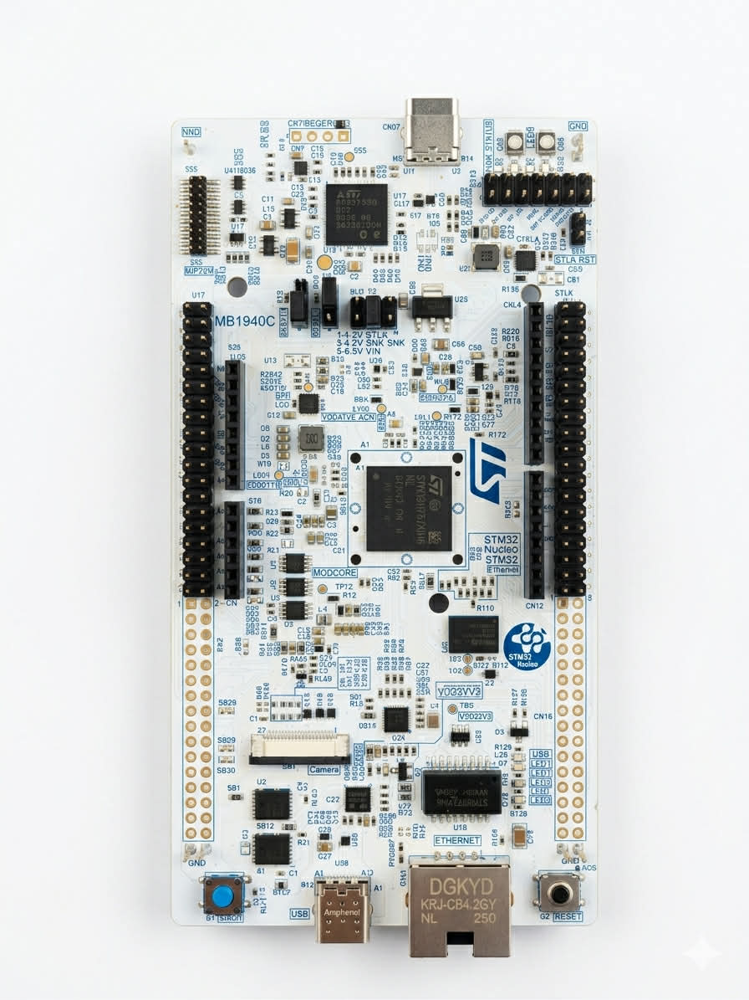

# ETRS606 - Embedded AI: Smart Weather Forecasting Project

## Overview

This repository gathers the practical labs and project work carried out as part of the **ETRS606 - Embedded AI** module. 

The main objective of this course is to design intelligent embedded systems by combining **sensors, microcontrollers, connectivity, and artificial intelligence**, with a specific focus on **Edge AI deployment on STM32 platforms**.

Throughout the project, we analyzed the engineering trade-offs required to deploy AI models on constrained hardware:
* **Memory footprint** (Flash and RAM usage)
* **Computational complexity** (MAC operations)
* **Inference latency** (Real-time performance)
* **Model accuracy** vs. Model size
* **Energy consumption** (Essential for remote deployment)

---

## Project Workflow

This project explores the complete lifecycle of an embedded AI system:
* **Data Science:** Neural network design and training using 10 years of historical meteorological data.
* **Embedded Development:** Firmware programming on STM32 using HAL drivers.
* **Sensor Interfacing:** Real-time data acquisition (Temperature, Humidity, Pressure) via I2C.
* **Connectivity:** Initial implementation with Ethernet (LwIP) and transition to **LoRa** for low-power long-range transmission.
* **Cloud Integration:** Data visualization on ThingSpeak / MATLAB.
* **Deployment:** Model conversion from **TensorFlow/Keras** to **C code** using **X-CUBE-AI**.

---

## Hardware Architecture

The project is built using the following hardware:

* **NUCLEO-H563ZI (MB1940C):** High-performance ARM Cortex-M33 MCU (up to 160 MHz), featuring 320 KB RAM and 512 KB Flash. It includes advanced hardware resources to accelerate AI inference.
* **NUCLEO-F446RE:** ARM Cortex-M4 MCU running at 180 MHz (128 KB RAM / 512 KB Flash).
* **X-NUCLEO-IKS01A3 Sensor Shield:** MEMS expansion board featuring:
    * Temperature & Humidity (HTS221)
    * Pressure (LPS22HH)
    * Motion sensors (Accelerometer/Gyroscope)

---

## Software & Tools

* **AI/ML:** Python, TensorFlow, Keras, ONNX, X-CUBE-AI.
* **IDE:** STM32CubeIDE, STM32CubeMX.
* **Firmware:** HAL Drivers, FreeRTOS, LwIP.
* **Analytics:** ThingSpeak, MATLAB.

---

## Hardware Configuration for Standalone Operation

A key challenge identified during the project was the power management. By default, the Nucleo board stops program execution when disconnected from the USB port due to the ST-LINK reset management.

To enable **Standalone Mode** (remote deployment on battery), the power routing must be reconfigured:

### 1. Jumper Configuration
To switch the power source from USB to an external supply, move the **JP5** jumper:
* **Default:** Jumper on **U5V** (Powered via ST-LINK USB).
* **Standalone:** Move the jumper to the **E5V** position.

### 2. External Wiring
Once the jumper is moved, the board must be powered via the Morpho headers:
* **EXT_IN (or VIN):** Connect the positive (+) 5V terminal.
* **GND:** Connect the ground (-) terminal.

> **Technical Note:** This hardware modification ensures that the AI model stored in the **Non-Volatile Flash memory** boots automatically upon power-up, bypassing the USB dependency and preventing the ST-LINK from holding the CPU in a permanent reset state.

---

## Energy Consumption Analysis

Energy efficiency is a core pillar of Edge AI. Since this weather station is designed for remote deployment via LoRa, we monitored the board's power draw to evaluate its autonomy.

### 1. Power Measurement Setup
To measure the real-time consumption, we used a digital multimeter in series with the external power supply. 
* **Operating Voltage:** 5V (via EXT_IN)
* **Measured Current:** ~130 mA during active AI inference and data processing.


### 2. Optimization Strategy
In a real-world scenario, the board does not need to be active 100% of the time. To extend battery life, the project explores the following states:
* **Active State:** The MCU collects sensor data, runs the AI inference, and transmits results.
* **Low-Power State:** Utilizing STM32 *Stop* or *Standby* modes between measurements to reduce consumption to the micro-amp ($\mu A$) range.

> **Note:** The current consumption of ~130 mA includes the ST-LINK debugger and status LEDs. In a final production prototype, separating the ST-LINK portion of the board would significantly lower this baseline.

---
## Real-Time Inference Results

The following output demonstrates the AI model running on the STM32 hardware. The system acquires environmental data and processes it through the neural network to output weather probabilities.

### 1. Sensor Data Acquisition
The model receives three primary inputs from the X-NUCLEO-IKS01A3 shield:
* **Temperature:** 26.37 °C
* **Humidity:** 50.01 %
* **Pressure:** 1022.88 hPa

### 2. AI Model Output (METEO AI)
The embedded model performs a classification task, assigning a probability to each possible weather state:


| Weather State | Probability |
| :--- | :--- |
| **Nuageux (Cloudy)** | **38.7%** |
| **Beau temps (Sunny)** | **26.8%** |
| **Pluie (Rain)** | **8.0%** |
| **Brouillard (Fog)** | **0.1%** |
| **Vent fort / Gel** | **0.0%** |

**Analysis:** In this specific example, the model identifies a dominant "Cloudy" state. The inference is performed locally on the MCU (**Edge AI**), meaning no data was sent to the cloud for this calculation, resulting in zero latency and enhanced privacy.
## Repository Structure

```text
ETRS606-GRP3/
├── README.md
├── TP1_MNIST/                       # Digit recognition on MCU
├── TP2_STM32_Sensors_Ethernet/      # Basic sensor data acquisition
├── TP3_Cloud_Connectivity/          # ThingSpeak integration
├── TP4_Cloud_vs_Edge_AI/            # Local inference vs Remote inference
└── docs/                            # Photos, diagrams, and technical datasheets
